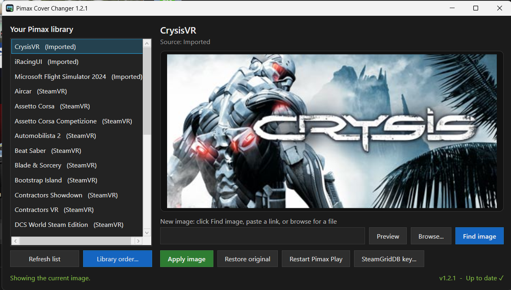
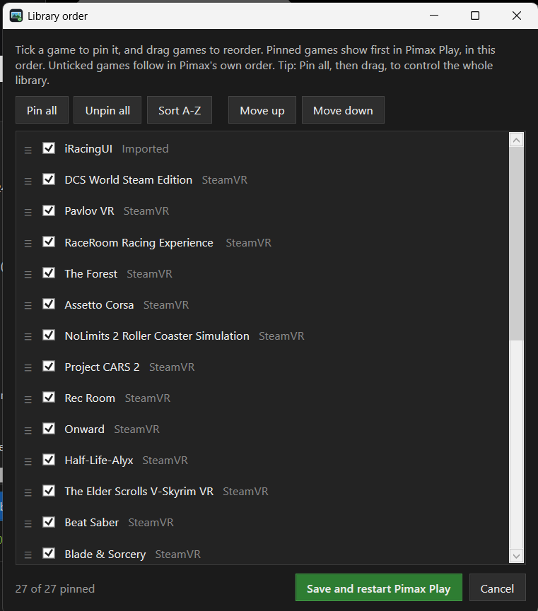

# Pimax Cover Changer

A small Windows tool for setting custom library images (cover art) in **Pimax Play**, especially for games you added with **Import**, which otherwise show the default gamepad tile.



## Download

Grab **`PimaxCoverChanger.exe`** from this repo and run it. It asks for admin rights because it restarts the Pimax service so the new image shows up.

Windows SmartScreen or Defender may warn about it as an unrecognized app. If you'd rather not run the exe, run the script instead (see below). It's the same code.

## How to use

1. Pick a game from your Pimax library on the left.
2. Click **Find image** to search for art automatically, or paste an image link, or click **Browse...** for an image file.
3. Click **Apply image**. The tool saves the image, updates the game's entry, and restarts Pimax Play.

Wide banner images (about 460x215 or 920x430) fit Pimax tiles best.

- **Restore original** puts a game back to its original image.
- **Restart Pimax Play** restarts Pimax without changing anything.

## Find image

**Find image** shows a gallery of matching art. Click one to use it.


- **Steam:** If the game is a Steam game, or an imported game whose .exe sits in a Steam library folder, the tool reads Steam's install records to get the exact game and shows its official banners. Otherwise it searches the Steam store by name. No account needed.
- **SteamGridDB (optional):** Adds many more choices, including community art and art for non-Steam games. Get a free API key by signing in at [steamgriddb.com](https://www.steamgriddb.com/), then **Preferences > API**. Paste it in with the **SteamGridDB key...** button. The key is stored locally in `%APPDATA%\Pimax\cover-changer-settings.json`.

If the automatic match is wrong, type a different name in the search box and click **Search by name**.

## Library order

Pimax Play normally lists Steam games by Steam app ID, then Oculus games, then imported games in the order you added them. The only order it lets you set is for **pinned** games, which always come first. **Library order...** uses that to let you arrange the whole library:



- Tick games to pin them, and drag them (or use **Move up / Move down**) into the order you want.
- **Pin all** then drag to control the entire list. **Sort A-Z** sorts alphabetically.
- **Save and restart Pimax Play** writes the order and reopens Pimax Play.

The order is saved in Pimax Play's own pinned list (`pinToTopGameArray` in `%APPDATA%\PimaxClient\config.json`). Only that list is changed; the rest of the file is left exactly as it was, and a backup is made the first time. Games you add later appear below the pinned ones until you place them.

## Updates

When the app opens, it checks this repo for a newer release in the background. If there is one, a bar at the top offers a **Download** button that opens the release page. Nothing is downloaded or installed automatically.

The bottom-right corner shows the app version and whether it's **Up to date**, has an **Update available**, or **Couldn't check** (for example when offline). Click it to check again.

## How it works

Pimax Play keeps each library entry as a JSON file in `%APPDATA%\Pimax\manifest`. The tile image comes from the entry's `icon` field, which accepts a web link or a local file path. This tool:

- copies the chosen image to `%APPDATA%\Pimax\covers` so it keeps working offline and if the original moves,
- backs up the original entry to `%APPDATA%\Pimax\cover-backups` the first time you change it,
- writes the entry back as UTF-8 **without a BOM** (Pimax silently drops entries saved with one),
- restarts Pimax: it stops Pimax Play, the `PiServiceLauncher` service and `PiPlayService.exe` (which holds the library in memory and survives a plain service restart), then starts them again.

## Notes

- Custom images on Steam games may be reset when Pimax rescans your library. Imported games keep theirs.
- Tested with Pimax Play 2.x. A future Pimax update could change how this works.

## Run from the script

```powershell
powershell -ExecutionPolicy Bypass -File .\PimaxCoverChanger.ps1
```

## Build the exe yourself

```powershell
Install-Module ps2exe -Scope CurrentUser
Invoke-ps2exe .\PimaxCoverChanger.ps1 .\PimaxCoverChanger.exe -iconFile .\PimaxCoverChanger.ico -noConsole -requireAdmin -STA -title "Pimax Cover Changer" -version 1.2.1
```

## License

[MIT](LICENSE)

Not affiliated with Pimax or Valve. Game art belongs to its respective owners.
