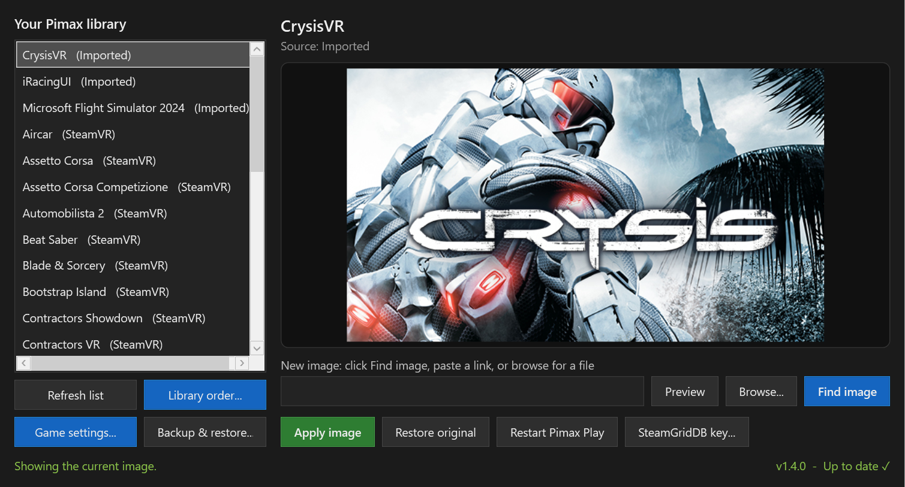
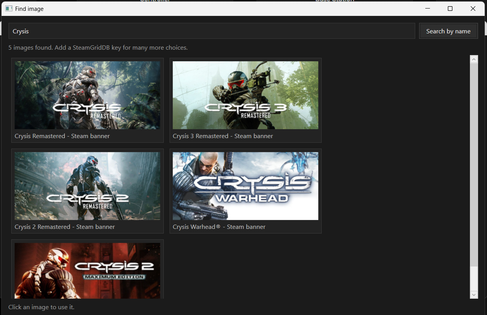
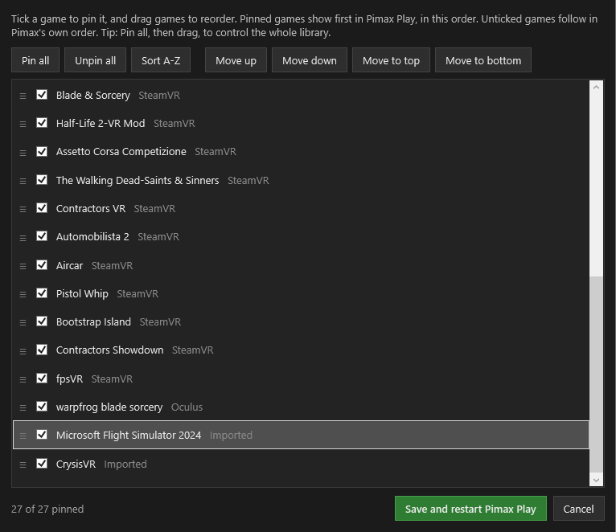
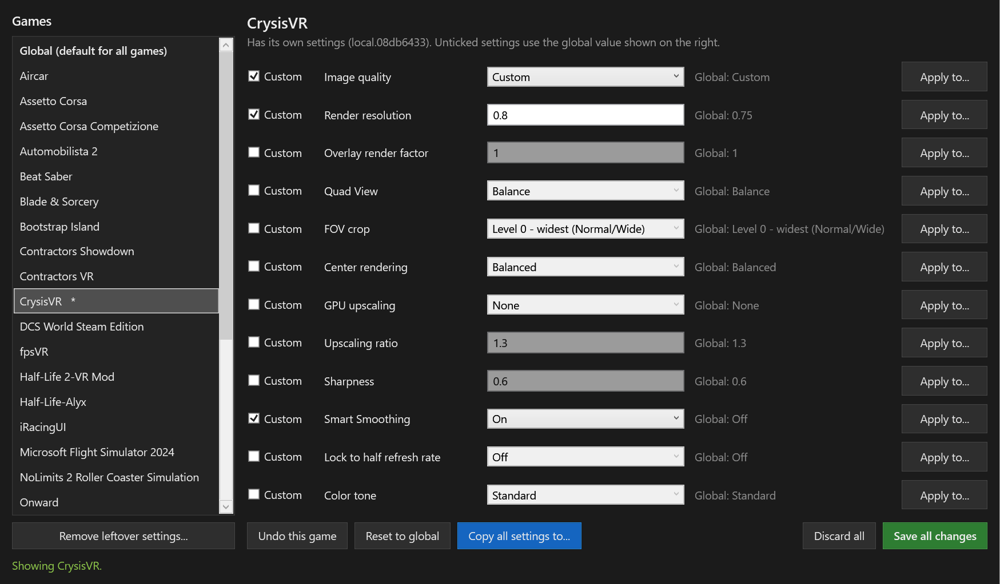
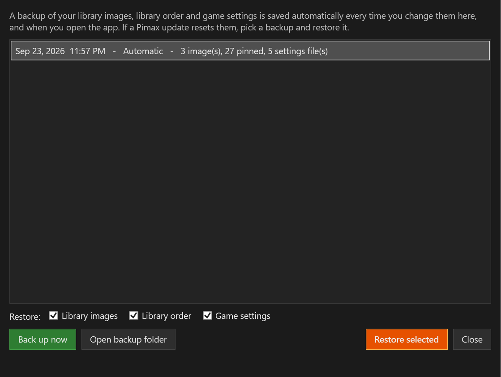

# Pimax Game Manager

A Windows tool for managing your **Pimax Play** library: set custom cover images (including for games added with **Import**), arrange the library in any order, edit per-game settings for many games at once, and back it all up so a Pimax update can't wipe your changes.

*Formerly Pimax Cover Changer.*



## Download

Get **`PimaxGameManager.exe`** from the [latest release](https://github.com/SFXShannon/pimax-game-manager/releases/latest) and run it. It asks for admin rights because it restarts the Pimax service so your changes take effect.

Windows SmartScreen or Defender may warn about it as an unrecognized app. If you'd rather not run the exe, run the script instead (see below). It's the same code.

## Library images

Custom images work for games added to Pimax Play with **Import**. For SteamVR and Oculus games, Pimax copies the image from Steam or Oculus every time it starts, so any change is overwritten within seconds; the app shows the current image but won't let you change it. To give a Steam or Oculus game your own image, add it with **Import** in Pimax Play.

1. Pick an imported game from your Pimax library on the left.
2. Click **Find image** to search for art automatically, or paste an image link, or click **Browse...** for an image file.
3. Click **Apply image**. The tool saves the image, updates the game's entry, and restarts Pimax Play.

Wide banner images (about 460x215 or 920x430) fit Pimax tiles best.

- **Restore original** puts a game back to its original image.
- **Restart Pimax Play** restarts Pimax without changing anything.

### Find image

**Find image** shows a gallery of matching art. Click one to use it.



- **Steam:** If the game is a Steam game, or an imported game whose .exe sits in a Steam library folder, the tool reads Steam's install records to get the exact game and shows its official banners. Otherwise it searches the Steam store by name. No account needed.
- **SteamGridDB (optional):** Adds many more choices, including community art and art for non-Steam games. Get a free API key by signing in at [steamgriddb.com](https://www.steamgriddb.com/), then **Preferences > API**. Paste it in with the **SteamGridDB key...** button. The key is stored locally in `%APPDATA%\PimaxGameManager\settings.json`.

If the automatic match is wrong, type a different name in the search box and click **Search by name**.

## Library order

Pimax Play normally lists Steam games by Steam app ID, then Oculus games, then imported games in the order you added them. The only order it lets you set is for **pinned** games, which always come first. **Library order...** uses that to let you arrange the whole library:



- Tick games to pin them, and drag them into the order you want. While dragging, a label shows which game you're moving and a blue line shows where it will land; hold near the top or bottom edge of the list to scroll. **Move up / Move down** and **Move to top / Move to bottom** move the selected game without dragging.
- **Pin all** then drag to control the entire list. **Sort A-Z** sorts alphabetically.
- **Save and restart Pimax Play** writes the order and reopens Pimax Play.

The order is saved in Pimax Play's own pinned list (`pinToTopGameArray` in `%APPDATA%\PimaxClient\config.json`). Only that list is changed; the rest of the file is left exactly as it was, and a backup is made the first time. Games you add later appear below the pinned ones until you place them.

## Game settings

Pimax Play lets you give each game its own graphics settings, one game at a time. **Game settings...** shows them all in one place and lets you work across games:



- **Edit any game**, or the **Global** settings every game uses by default. Tick **Custom** on a setting to give a game its own value; unticked settings follow Global, which is shown next to each one.
- **Apply to...** on any setting copies just that setting to the games you pick. For example, turn on Smart Smoothing for all your sims in one go.
- **Copy all settings to...** gives other games exactly the same settings as the one you're viewing.
- **Reset to global** clears a game's custom settings so it follows Global again. On the Global entry it becomes **Reset to Pimax defaults**.
- **Save all changes** writes everything at once. Your edits are kept as you move between games (games with unsaved changes show in orange), and Apply to, Copy all and Reset are queued too, so Pimax only restarts once. **Undo this game** and **Discard all** throw edits away, and you're asked before closing with unsaved changes.
- **Remove leftover settings...** tidies up settings files for games no longer in your library (for example after re-importing a game, which gives it a new ID).

Settings covered: image quality and render resolution, overlay render factor, Quad View, FOV crop, center rendering, GPU upscaling (algorithm, ratio, sharpness), Smart Smoothing, lock to half refresh rate, and color tone. Games with their own settings are marked with `*` in the list. Advanced fine-tuning (custom Quad View and FOV values, color channels) is kept as-is and is still edited in Pimax Play.

Settings live in `%APPDATA%\Pimax\AppConfig` (`global.json` plus one file per game, named by the game's ID). Each file is backed up to `%APPDATA%\PimaxGameManager\backups\settings` before its first change.

## Backup & restore

Pimax updates sometimes reset library images, the library order or game settings. Pimax Game Manager keeps its own backups so you can put them back.



- **Automatic backups:** every time you apply an image, save the library order or save game settings, and each time you open the app, a backup is saved (only when something changed). The newest 20 automatic backups are kept; ones you make with **Back up now** are kept until you delete them.
- **Reset detection:** when the app opens it compares Pimax with your latest backup. If images, the order or settings files have gone missing, an orange bar offers to **Restore** them.
- **Restore:** in **Backup & restore...**, pick a backup and choose what to restore: library images, library order, game settings, or any mix. Your current state is backed up first, so a restore can be undone. Games that were removed and imported again get a new ID in Pimax; they are matched by their .exe path.

Backups are stored in %APPDATA%\PimaxGameManager\snapshots, outside Pimax's folders. Each one is a folder with the images, the settings files and a snapshot.json describing the library order and which image goes with which game.

## Updates

When the app opens, it checks this repo for a newer release in the background. If there is one, a bar at the top offers a **Download** button that opens the release page. Nothing is downloaded or installed automatically.

The bottom-right corner shows the app version and whether it's **Up to date**, has an **Update available**, or **Couldn't check** (for example when offline). Click it to check again.

## How it works

Pimax Play keeps each library entry as a JSON file in `%APPDATA%\Pimax\manifest`. The tile image comes from the entry's `icon` field, which accepts a web link or a local file path. This tool:

- copies the chosen image to `%APPDATA%\PimaxGameManager\covers` so it keeps working offline, if the original moves, and if Pimax clears its own folder,
- backs up the original entry to `%APPDATA%\PimaxGameManager\backups` the first time you change it,
- writes files back as UTF-8 **without a BOM** (Pimax silently drops entries saved with one),
- restarts Pimax: it stops Pimax Play, the `PiServiceLauncher` service and `PiPlayService.exe` (which holds the library and settings in memory and survives a plain service restart), then starts them again. Game settings are written while Pimax is stopped so it can't overwrite them.

## Notes

- Custom images only work for imported games; Pimax rebuilds Steam and Oculus entries from those stores every time it starts.
- Tested with Pimax Play 2.x. A future Pimax update could change how this works.

## Run from the script

```powershell
powershell -ExecutionPolicy Bypass -File .\PimaxGameManager.ps1
```

## Build the exe yourself

```powershell
Install-Module ps2exe -Scope CurrentUser
Invoke-ps2exe .\PimaxGameManager.ps1 .\PimaxGameManager.exe -iconFile .\PimaxGameManager.ico -noConsole -requireAdmin -STA -title "Pimax Game Manager" -version 1.4.3
```

## License

[MIT](LICENSE)

Not affiliated with Pimax or Valve. Game art belongs to its respective owners.
